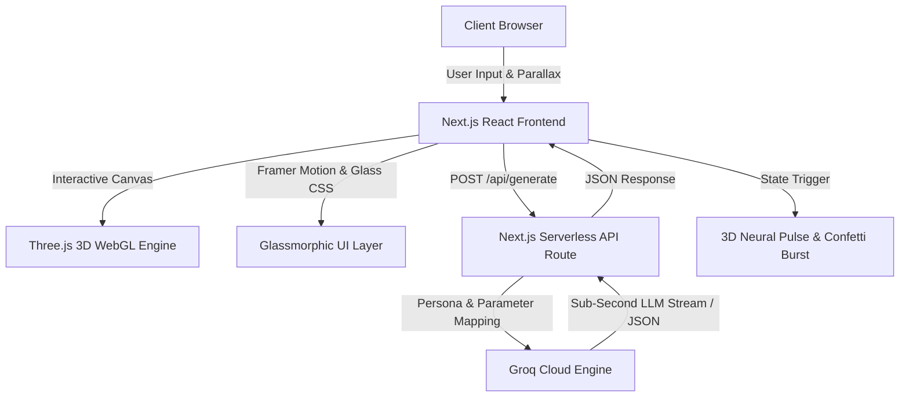

<div align="center">

# 🌌 OmniText AI Studio
### *Next-Generation 3D Spatial AI Text Synthesis Platform Powered by Groq*

[](https://nextjs.org/)
[](https://reactjs.org/)
[](https://threejs.org/)
[](https://groq.com/)
[](https://tailwindcss.com/)
[](https://www.framer.com/motion/)
[](LICENSE)

<p align="center">
  <b>OmniText AI Studio</b> bridges <b>interactive 3D spatial computing</b> with <b>ultra-low latency generative AI</b>.<br />
  Designed with frosted glass aesthetics, reactive WebGL animations, dynamic persona orchestration, and lightning-fast Groq inference.
</p>

[Explore Features](#-core-features) • [Architecture](#-system-architecture) • [Getting Started](#-getting-started) • [API Specs](#-api-reference) • [Deployment](#-deployment)

</div>

---

## 📑 Table of Contents
1. [🌟 Core Features](#-core-features)
2. [🏗️ System Architecture](#-system-architecture)
3. [🎮 3D WebGL Engine (Three.js)](#-3d-webgl-engine-threejs)
4. [🔮 Glassmorphism UI & Motion Design](#-glassmorphism-ui--motion-design)
5. [⚡ Groq AI Integration & Model Suite](#-groq-ai-integration--model-suite)
6. [📁 Project Directory Structure](#-project-directory-structure)
7. [🚀 Getting Started & Installation](#-getting-started--installation)
8. [⚙️ Environment Configuration](#-environment-configuration)
9. [📡 API Reference](#-api-reference)
10. [🎨 Customization Guide](#-customization-guide)
11. [🚢 Production Deployment](#-production-deployment)
12. [❓ Troubleshooting & FAQ](#-troubleshooting--faq)
13. [📜 License](#-license)

---

## 🌟 Core Features

- 🌌 **Interactive 3D Spatial Canvas**: Real-time Three.js WebGL particle field and wireframe neural core responding to mouse movement and state shifts.
- ⚡ **Ultra-Low Latency Inference**: Powered by Groq's LPU™ architecture for generation speeds exceeding 300–500 tokens/second.
- 🔮 **Glassmorphism Design System**: Layered frosted glass panels, neon gradient accents, backdrop filters, and custom reactive scrollbars.
- 🎭 **Persona Tuning Suite**: One-click personas adapting system prompts for creative writing, business analysis, coding, or concise briefings.
- 🎛️ **Engine Controls**: Full control over AI models, temperature/creativity coefficients, and prompt parameters.
- 💡 **One-Click Presets & Randomizer**: Quick prompt templates and a "Surprise Me" generator for instant exploration.
- 💾 **Productivity Utilities**: Copy-to-clipboard with visual confirmation, instant Markdown file export, and session history persistence.
- 🎉 **Celebratory Feedback**: Confetti particle physics upon generation completion.

---

## 🏗️ System Architecture



---

## 🎮 3D WebGL Engine (Three.js)

The application features a dedicated, memory-managed Three.js viewport rendered in the background:

- **Particle Starfield**: 700+ vertex-colored 3D points with additive blending scattered across a dynamic depth volume.
- **Wireframe Neural Lattice**: A multi-tiered geometric structure composed of an outer `IcosahedronGeometry`, an inner rotating `OctahedronGeometry`, and concentric `TorusGeometry` rings.
- **Parallax Smoothing**: Cursor tracking with dampening algorithms to produce cinematic depth without viewport jitter.
- **State-Driven Dynamics**: When synthesis begins (`isGenerating = true`), rotation multipliers increase, core opacity intensifies, and ring orbital velocities accelerate.

---

## 🔮 Glassmorphism UI & Motion Design

Built using custom Tailwind CSS utility layers:
- **`glass-panel`**: Multi-layer translucent surface with `backdrop-filter: blur(16px)` and subtle white borders (`rgba(255, 255, 255, 0.1)`).
- **`glass-panel-glow`**: Ambient purple/cyan neon rim glow with soft drop shadows.
- **`glass-input`**: High-contrast dark input fields that illuminate upon focus.
- **Framer Motion**: Graceful layout animations, accordion settings reveals, and micro-interactions on hover and click.

---

## ⚡ Groq AI Integration & Model Suite

OmniText AI leverages Groq's high-speed inference engine to deliver instant responses.

### Supported Models

| Model Identifier | Parameter Scale | Recommended Use Case |
|---|---|---|
| **`openai/gpt-oss-120b`** | 120 Billion | **Flagship**: Deep reasoning, complex problem solving, comprehensive writing |
| **`openai/gpt-oss-20b`** | 20 Billion | **Instant**: High-throughput summaries, quick queries, fast drafts |
| **`qwen/qwen3.6-27b`** | 27 Billion | Multilingual tasks, logical structuring, structured code synthesis |
| **`groq/compound-mini`** | Optimized | Lightweight compound tasks and rapid prototyping |

### Persona System

| Persona | Archetype | Output Characteristics |
|---|---|---|
| ⚖️ **Balanced** | Helpful Polymath | Objective, structured, clear paragraphs |
| 🎨 **Creative** | Storyteller & Poet | Vivid imagery, evocative vocabulary, expressive cadence |
| 💼 **Professional** | Executive Advisor | Concise executive summaries, formal tone, strategic insights |
| 💻 **Coder** | Senior Full-Stack Lead | Syntactically clean code, modern patterns, architectural notes |
| ⚡ **Concise** | Information Architect | Ultra-dense bullet points, zero fluff |

---

## 📁 Project Directory Structure

```text
ai-text-generator/
├── components/
│   ├── ThreeBackground.jsx      # Three.js 3D WebGL particle & core engine
│   └── ui/                      # Glassmorphic UI design system
│       ├── badge.jsx            # Gradient status tags
│       ├── button.jsx           # Glowing & frosted glass buttons
│       ├── card.jsx             # Glass container primitives
│       ├── input.jsx            # Glass text input
│       └── textarea.jsx         # Auto-sized frosted prompt textarea
├── lib/
│   └── utils.js                 # Classname merge utility (clsx + tailwind-merge)
├── pages/
│   ├── api/
│   │   └── generate.js          # Groq API route with persona orchestration
│   ├── _app.jsx                 # Global app configuration & metadata
│   └── index.jsx                # Interactive 3D Studio dashboard
├── styles/
│   └── globals.css              # Custom glassmorphism classes & glow utilities
├── .env.example                 # Environment variables template
├── .env.local                   # Local credentials (git-ignored)
├── .gitignore                   # Git protection rules
├── jsconfig.json                # Module alias resolution (@/*)
├── package.json                 # Project dependencies & scripts
├── postcss.config.js            # PostCSS configuration
├── tailwind.config.js           # Tailwind theme extensions & animations
└── README.md                    # Project documentation
```

---

## 🚀 Getting Started & Installation

### 1. Prerequisites
- **Node.js**: `v18.0.0` or higher
- **npm**: `v9.0.0` or higher (or `pnpm` / `yarn`)
- A valid **Groq API Key** from [console.groq.com](https://console.groq.com/keys)

### 2. Clone the Repository
```bash
git clone https://github.com/tchatrathbe23-blip/OmniAI.git
cd OmniAI
```

### 3. Install Dependencies
```bash
npm install
```

### 4. Configure Environment Variables
Create a `.env.local` file in the root directory:
```bash
cp .env.example .env.local
```
Edit `.env.local` and add your Groq API key:
```env
GROQ_API_KEY=your_groq_api_key_here
```

### 5. Launch Development Server
```bash
npm run dev
```
Open your browser at **[http://localhost:3000](http://localhost:3000)**.

---

## ⚙️ Environment Configuration

| Variable | Required | Description | Default |
|---|---|---|---|
| `GROQ_API_KEY` | **Yes** | Your private Groq API key | — |
| `OPENAI_API_KEY` | No | Fallback key if using standard OpenAI endpoints | — |

> 🔒 **Security Notice**: `.env.local` is listed in `.gitignore`. Never commit your real API keys to version control.

---

## 📡 API Reference

### Text Generation Endpoint

```http
POST /api/generate
Content-Type: application/json
```

#### Request Payload
```json
{
  "prompt": "Explain the concept of zero-knowledge proofs in simple terms.",
  "model": "openai/gpt-oss-120b",
  "tone": "balanced",
  "temperature": 0.7,
  "maxTokens": 1024
}
```

#### Request Parameters
- `prompt` *(string, required)*: The input prompt.
- `model` *(string, optional)*: One of `openai/gpt-oss-120b`, `openai/gpt-oss-20b`, `qwen/qwen3.6-27b`, `groq/compound-mini`. Default: `openai/gpt-oss-120b`.
- `tone` *(string, optional)*: One of `balanced`, `creative`, `professional`, `coder`, `concise`. Default: `balanced`.
- `temperature` *(number, optional)*: Float between `0.1` and `1.2`. Default: `0.7`.
- `maxTokens` *(number, optional)*: Maximum output tokens. Default: `1024`.

#### Success Response (`200 OK`)
```json
{
  "result": "Zero-knowledge proofs are a cryptographic method...",
  "model": "openai/gpt-oss-120b",
  "usage": {
    "prompt_tokens": 28,
    "completion_tokens": 142,
    "total_tokens": 170
  },
  "isDemo": false
}
```

#### Error Response (`400 / 500`)
```json
{
  "error": "Failed to generate text from Groq. Please check your Groq API key.",
  "details": "GROQ_ERROR"
}
```

---

## 🎨 Customization Guide

### Adding New Personas
Open [`pages/api/generate.js`](pages/api/generate.js) and add your custom prompt instruction:
```javascript
const PERSONA_PROMPTS = {
  // ... existing personas
  philosophical: "You are a contemplative philosopher. Analyze themes with existential and metaphysical depth.",
};
```
Then add the option to the `<select>` in [`pages/index.jsx`](pages/index.jsx).

### Modifying 3D Geometries
Edit [`components/ThreeBackground.jsx`](components/ThreeBackground.jsx) to customize particle counts, rotation speeds, mesh topologies (e.g. `TorusKnotGeometry`, `DodecahedronGeometry`), or color palettes.

---

## 🚢 Production Deployment

### Deploy on Vercel (Recommended)
1. Push your code to GitHub.
2. Import the project into [Vercel](https://vercel.com).
3. In project settings, add the Environment Variable:
   - Name: `GROQ_API_KEY`
   - Value: `your_actual_api_key`
4. Click **Deploy**.

### Manual Production Build
```bash
npm run build
npm run start
```

---

## ❓ Troubleshooting & FAQ

<details>
<summary><b>1. GitHub Push Protection blocked my push (Secret Scanning)</b></summary>
If you accidentally committed an API key:
1. Ensure `.env.local` is added to `.gitignore`.
2. Remove any hardcoded keys from source code.
3. Reset unpushed commits: `git reset HEAD~1` (or unstage the file with `git rm --cached .env.local`).
4. Re-commit cleanly and push.
</details>

<details>
<summary><b>2. Why do I see a 404 on `/api/generate`?</b></summary>
Next.js Pages Router expects API files under `pages/api/`. Verify that `pages/api/generate.js` exists and rebuild the app using `npm run build` or restart `npm run dev`.
</details>

<details>
<summary><b>3. Model does not exist error on Groq</b></summary>
Groq updates its model catalog periodically. The current active models are `openai/gpt-oss-120b`, `openai/gpt-oss-20b`, `qwen/qwen3.6-27b`, and `groq/compound-mini`. Ensure you select one of these active model names.
</details>

---

## 📜 License

This project is open-source software licensed under the [MIT License](LICENSE).

<div align="center">
  <sub>Built with 💜 by pairing Next.js, Three.js 3D, and Groq LLMs.</sub>
</div>
